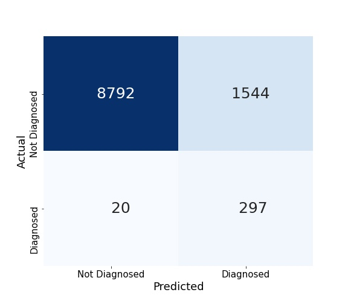

# ASD Factors ML
## Autism Spectrum Disorder
Autism Spectrum Disorder (ASD) is a developmental disability that affects how a person experiences the world. Autism affects the way a person thinks, communicates, and socializes. It's important to note that these differences do not indicate that something is wrong with the person and autism is not something to be cured. Autism is a part of who a person is, and treatment for it is about learning how to live with the disorder in a neurotypical world, not about removing or changing aspects of who the person is is. For more information about autism, refer to [this page on the Autistic Self Advocacy Network website.](https://autisticadvocacy.org/about-asan/about-autism/)

## Not A Diagnostic Tool
We've made a few models that predict whether a child is diagnosed with ASD or not. These models are useful primarily to extract feature importance from, and not as actual predictors.  
**None of our models can be used for diagnosis, and if you think you or your child have a disorder, then you should speak with a mental health professional about it.**

## Our Goal
Our goal is to analyze factors that may indicate someone is autistic in order to encourage people who think they or their child may be autistic to seek diagnosis. Diagnosis can be an important step for improving quality of life for an autistic person; once a person knows they're autistic and what that looks like for them, it allows them to learn coping strategies in order to better navigate the neurotypical world that we live in.  
To reiterate, **our goal is not to diagnose anyone.** Rather, we wish to encourage those who think they might be autistic to seek diagnosis from a mental health professional.

## Who Cares?
Groups such as the [Autistic Self Advocacy Network](https://autisticadvocacy.org/about-asan/) work to empower autistic people to take control of their own lives. An important step toward that goal is for people to be educated about ASD, and diagnosed if they think they are autistic.  
We're going to look at factors that could indicate someone is autistic as a means to encourage people to educate themselves about autism.

## The Data
Data about ASD can be difficult to find, so we're using the topical data from the [National Survey of Children's Health](https://www.census.gov/programs-surveys/nsch/data/datasets.html) for the year of 2020. While this data isn't primarily focused on ASD, it does have data about ASD diagnosis. This data has a few limitations, but will work for our purpose. The main limitations are:
- The portion of children diagnosed with autism is small, which means we need to address this class imbalance in our modeling.
- The variables related to autism rely on a diagnosis from a medical professional. This is a limitation because autism often goes undiagnosed, and some people realize they or their child are autistic and choose not to get diagnosed for various reasons. This limitation is less with the data and more the nature of diagnosis, but it will affect how we need to score our model.
- The data is only collected about children. This a problem that pervades a lot of research about autism; it's often only studied in children despite the fact that autistic children grow up into autistic adults. Because of this, we're only focusing on children, so this limitation doesn't matter for modeling, but is noteworthy for interpretation of the results.

## Methods
**Considerations:**
- Since our goal is interpretation, we'll want to tend toward easily interpretable models.
- Since ASD is uncommon, we'll need to account for the class imbalance. This means not using accuracy as a primary metric; since a model that guesses nobody is autistic has a 97% accuracy.
- False positives are unreliable as it's impossible to know what portion of them are undiagnosed autistic children. This means precision isn't a very useful metric for scoring our models.
- Recall is likely to be our most reliable metric, since we want to minimize false negatives to see what features our models find important.

### Preprocessing
Our first step was cleaning the data into a fully usable form. This was a challenge because of the sheer size of the data; we had 443 columns, and we couldn't drop all null values since that would lose us too much of our data. So instead, we looked over the [Topical Variable List](https://www2.census.gov/programs-surveys/nsch/technical-documentation/codebook/2020-NSCH-Topical-Variable-List.pdf) for the NSCH data. Looking at each column, we decided how to handle each column, dropping some and filling null values in the rest. We did drop some columns without investigation, but we manually decided how most columns would be handled. For information about how each column was handled and why, refer to [this file.](https://github.com/pjlannoo/ASD-Factors-ML/blob/main/Notebooks/DataNotes.md)  
The only other preprocessing step we needed to do was create an undersampled subset of the data in order to account for class imbalance in models that lack another way to account for class weight.

### Modeling
With the preprocessor ready to use, we began modeling. We tried a few different model types, but focused mainly on decision trees, since they do the best job of narrowing down our extensive feature list to a few useful features for interpretation.  
  
After tuning a decision tree, we got a final model with a recall of 93.6%, an accuracy of 85.3%, and a precision of 16.1%. This means that it's correctly predicting most of the autistic children, but overpredicting diagnosis. This means that our important features are correlated to ASD, but that correlation is being overemphasized by the decision tree.

### Results
Our best model returned eight important features, which described whether the child needed additional support in areas such as communication or socializing, as well as if the child's health insurance covers mental healthcare. All of this makes sense; the need for additional support can be directly traced back to autistic traits, and a lack of mental health coverage would lead to a child not seeing a mental health professional (and therefore not getting diagnosed).

## Conclusions
These results can lead us to one primary conclusion: If you think your child needs additional support in areas of communication and socialization, and you are able to, look into the diagnostic process for ASD.